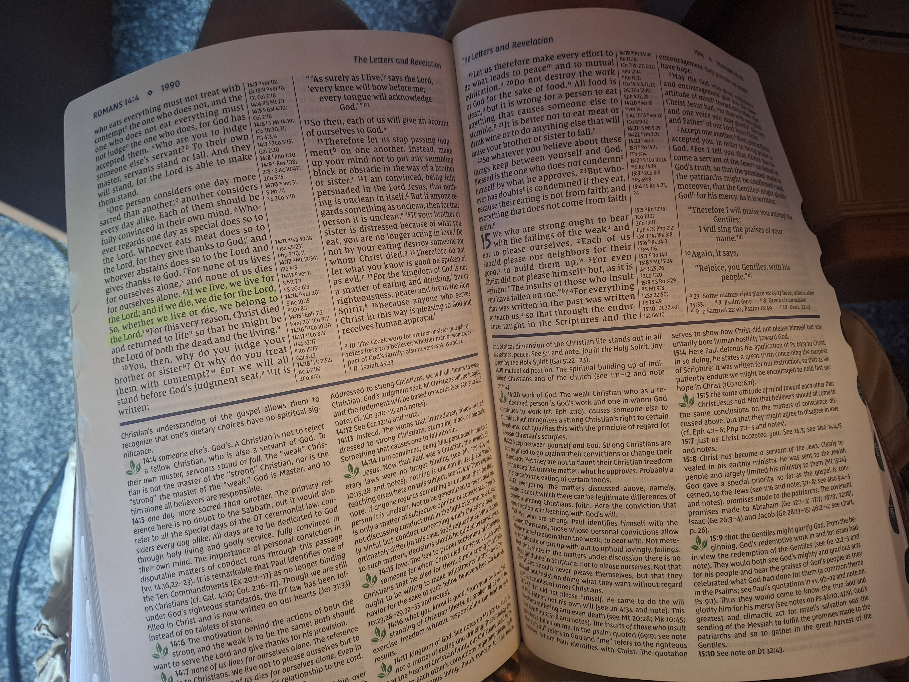

# GaryJ7.github.io

<!DOCTYPE html>
<html>

<body>

<h1>About Me</h1>

My name is Gary Johnson. I am from Churchville,  NY so I am no stranger to RIT. Despite living in Rochester weather all my life, I still hate the cold. I like the idea of snow until I have to shovel it or be in the cold for a extended period of time. I went to Caledonia-Mumford high school, rather than Churchville-Chili. My high school had a graduating class of 70 which is slightly smaller that RIT's ~4,000. I am a third generation RIT student, both my parents, and my grandfather (on my mom's side) went to RIT all for EEEE. SE is far superior than EEEE will ever be. Golisano >>> Gleason.

 I am a Christian, who is part of ACF (Agape Christian Fellowship) here at RIT. ACF combines U of R as well. MY faith is very important to me as God is the center of my life. I build my life around Him. Cal-Mum was not the best school for growing in my faith, and RIT is a very liberal college so I am very thankful for ACF. That being said, I came to RIT to further my passion as a SE major by working with/through God, hoping to make Him proud. 

Some other passions I have are programming, going for walks, and hanging out with friends. The basics. As for programming languages I have a basic leveling of understanding in JavaScript and Python, to the point where I can perform simple tasks like something given in GCIS 123/4 pretty easily. I have touched upon SQL with SSMS, creating simple databases for a fun side project. I have dabbled with Ignition, using their Vision and Perspective software. I used C# for a Unity game project but that was a long time ago so I have lost most of my skills in C#, as well as my C++ for Android Studios. I used to make simple websites with HTML and CSS but, again, that was freshman year of high school, so I have forgotten most of it. 

<a href="https://www.se.rit.edu/~swen-101/00/index.html">SE Website Link</a>

My daily bread is my favorite food. 

</body>

</html>
